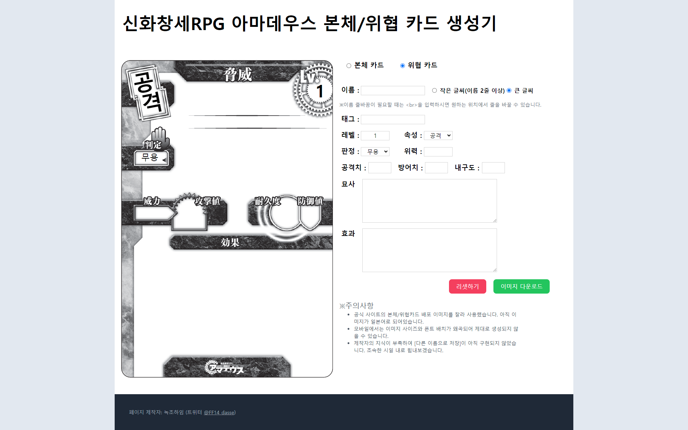

# amadeus-threat-card

## Table of contents

- [개요](#개요)
  - [스크린샷](#스크린샷)
  - [링크](#링크)
- [개발과정](#개발과정)
  - [사용 프레임워크 및 툴](#사용-프레임워크-및-툴)
  - [배운 것들](#배운-것들)
  - [개선점](#개선점)
  - [유용한 문서들](#유용한-문서들)
- [개발자](#개발자)

## 개요

TRPG 게임인 '신화창세RPG 아마데우스'에서 사용하는 카드를 빠르게 생성하기 위한 사이트입니다.
데이터를 입력하면 지정된 위치에 텍스트가 들어가고, 저장버튼으로 텍스트가 합성된 이미지를 다운로드를 할 수 있습니다.

### 스크린샷

### 링크

- Live Site URL: [Add live site URL here](http://bundasse.dothome.co.kr/)

## 개발과정

### 사용 프레임워크 및 툴

- HTML5
- CSS3
- Flexbox
- [Vue.js](https://vuejs.org/) - JS framework
- [Tailwind Css](https://tailwindcss.com/) - CSS framework
- [dom-to-image](https://github.com/tsayen/dom-to-image) - 이미지 위에 텍스트를 입혀서 파일로 저장할 수 있는 라이브러리
- [Filesaver](https://github.com/eligrey/FileSaver.js/) - 파일 저장 라이브러리

### 배운 것들

dom-to-image를 사용해서 이미지와 문자열을 합쳐 새로운 이미지로 생성하는 과정을 구현해냈다.

정규표현식을 이용해 input에 숫자, 영어, 혹은 원하는 문자만 입력할 수 있게 만들었다. 이전에는 선생님들이 가르쳐준 정규식이나 인터넷에 검색해서 나온 정규식을 활용하기만 했는데, 이번에 정규표현식의 문법이나 형식을 좀 더 자세히 공부할 수 있었다.

### 개선점

1. 디자인.
2. '다른 이름으로 저장'이 작동하지 않는 오류
3. 다른 카드 디자인을 첨부하기
4. 모바일 환경에서도 좌표가 어긋나지 않게 수정하기

### 유용한 문서들

- [『곽철용 짤 생성기』, 이렇게 만들어졌습니다](https://wormwlrm.github.io/2019/10/13/Kwakcheolyong-Image-Creator-Development-Story.html)
처음 '이런 웹앱을 만들어볼 수 있겠다!'라는 아이디어를 얻게 된 글.
아직 쓸 줄 아는 프레임워크가 vue밖에 없었는데 마침 사용하신 것이 vue여서 큰 도움을 받았다. dom-to-image가 있다는 것도 이 글을 통해서 알게 되었다. 

- [[자바스크립트] 웹 문서 화면 이미지 다운로드하기 | dom-to-image | filesaver](https://penguingoon.tistory.com/237)
dom-to-image를 사용하는데서 배포페이지의 소개만으로는 구현방법을 잘 알 수 없었는데 이 글 덕분에 이해하고 원하는 기능을 만들어낼 수 있었다.

- [📚 JavaScript 정규 표현식 문법 총정리 + 응용 예제](https://inpa.tistory.com/entry/JS-%F0%9F%93%9A-%EC%A0%95%EA%B7%9C%EC%8B%9D-RegExp-%EB%88%84%EA%B5%AC%EB%82%98-%EC%9D%B4%ED%95%B4%ED%95%98%EA%B8%B0-%EC%89%BD%EA%B2%8C-%EC%A0%95%EB%A6%AC)
- [RegExr](https://regexr.com/)
원하는 키만 입력되도록 하는 식을 짜기 위해 정규표현식을 이참에 제대로 익혀봤다. 테스트 사이트를 이용하는 법도 알게되었다!

## 개발자

- Github - [bundasse](https://github.com/bundasse)
